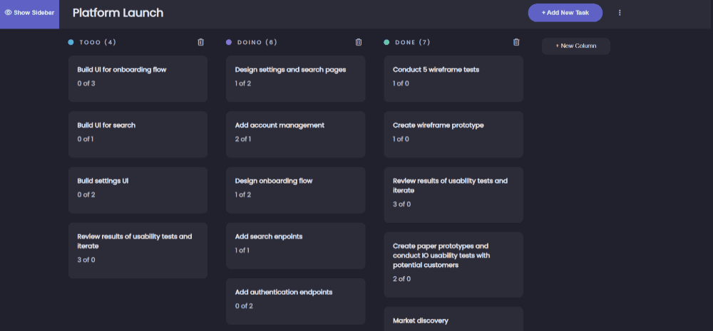

# Time Management Application

Our project is a project and task management tool that helps in improving productivity and organizing work. The project focuses on helping teams and individuals organize and manage their time and tasks effectively. The project includes several key features:

1. **Time Management:** Users can create projects and set time schedules for their tasks. Target dates can be set for completion of tasks and projects, which helps in setting priorities and urgent tasks.

2. **Division of tasks:** The project allows the division of large tasks into small and separate tasks. This helps in presenting the work into smaller pieces that can be handled more easily and efficiently.

3. **Track End Statuses:** Users can set end statuses for each task, such as 'Not Started', 'In Progress', 'Finished', etc. This helps in keeping track of work progress and in understanding the current status of tasks.

4. **Patio display:** There is a screen dedicated to displaying the percentages earned for each task. Users can see how well each task has been completed and whether it is going according to the set schedules.

This project aims to improve the management of projects and tasks, and provides an easy-to-use interface that makes it easier for users to organize and follow up their work effectively.

## Features

Of course, here is a list of the main features of the time and task management project I described:
 
1. **Division of tasks:**
    Divide large projects and tasks into small, specific tasks.
    Set target dates for each task.
 
2. **Track completion statuses:**
    Define the statuses of your tasks such as "not started", "in progress", "finished".
    Determine the percentage of completion for each task.

3. **Time Management:**
    - Setting dates and target dates for projects and tasks.
 
4. **View earned percentages:**
    Display the percentage of completion for each task visually on the user interface.

5. **Communication and Collaboration:**
     - Notifications for new task updates or comments.

6. **User interface customization:**
    - Provide a simple and easy to use user interface.
 
These key features help to achieve the goal of managing time and tasks more effectively and organized. Of course, the features can be customized according to the needs and requirements of your actual project.

## Installation
1. **You must go to the Back-End file and download npm install**
2. **You must go to the Front-End file and download npm install**
3. **After downloading NPM, we must upload the data to mongodb**
4. **You will find a JSON file named webTask.tasks that you will upload to mongodb***
5. **Then the server must be started by entering the Back-End file and writing npm run dev**
6. **Then the server must be started by entering the Front-End file and writing npm start**

## The Use

**All commands are smooth and easy to use, and all the things you want to perform are clarified smoothly**

## Photo Gallery
 
